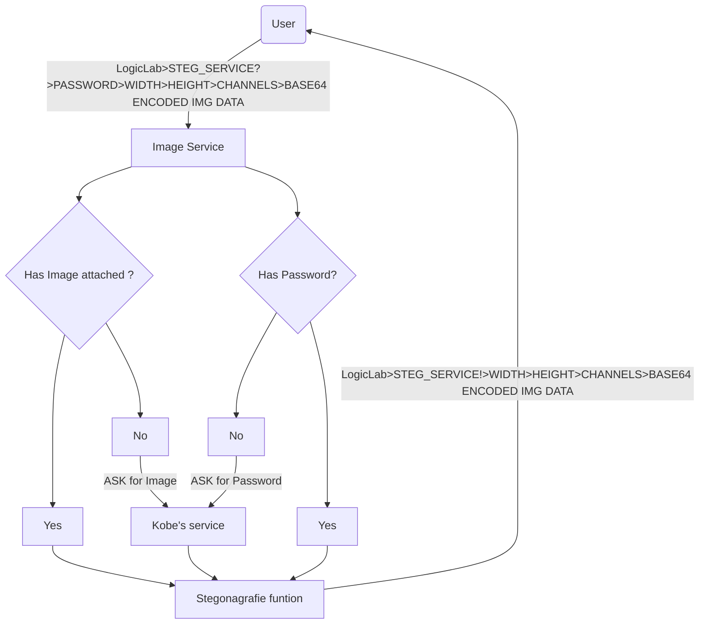
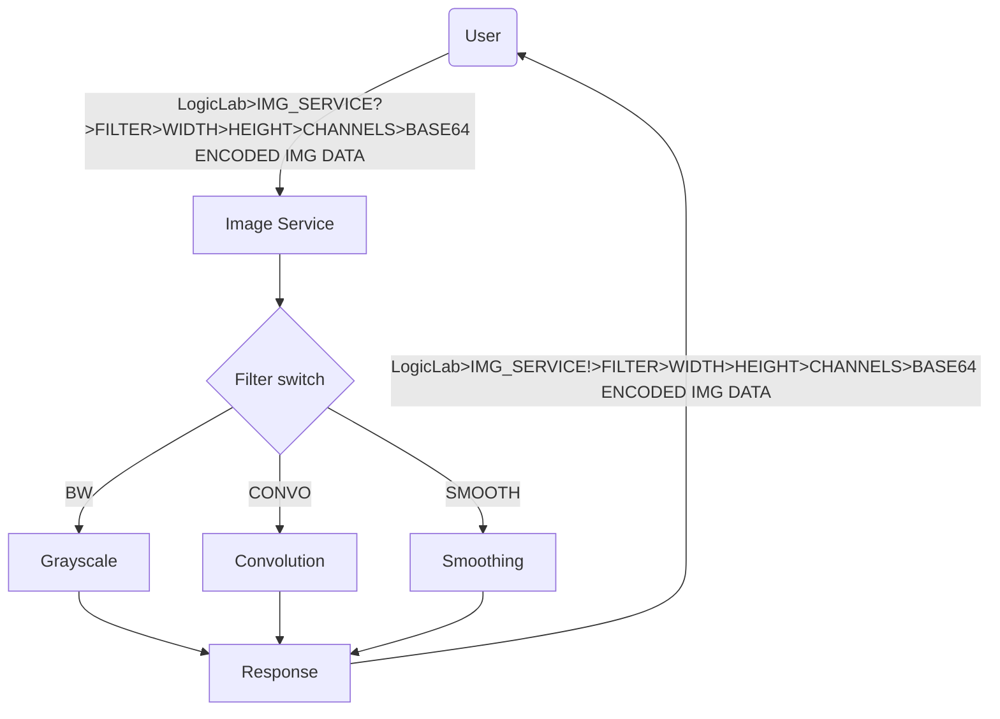

## Steganografie  service

```mermaid
flowchart TD
User(User)
Service[Image Service]
Kobe[Kobe's service]
Stegfun[Stegonagrafie funtion]
NO_img[No]
YES_img[Yes]
NO_PASS[No]
YES_PASS[Yes]

User --> |LogicLab>STEG_SERVICE?>PASSWORD>WIDTH>HEIGHT>CHANNELS>BASE64 ENCODED IMG DATA| Service

Service --> IF_IMG{Has Image attached ?}
IF_IMG --> NO_img
NO_img --> |ASK for Image|Kobe
IF_IMG --> YES_img
YES_img --> Stegfun
Kobe --> Stegfun

Service --> IF_PASS{Has Password?}
IF_PASS --> NO_PASS
NO_PASS --> |ASK for Password|Kobe
IF_PASS --> YES_PASS
YES_PASS --> Stegfun
Stegfun --> |LogicLab>STEG_SERVICE!>WIDTH>HEIGHT>CHANNELS>BASE64 ENCODED IMG DATA| User


```
## Filter service

```mermaid
flowchart TD
User(User)
Service[Image Service]
Filter{Filter switch}

Response[Response]

User --> |LogicLab>IMG_SERVICE?>FILTER>WIDTH>HEIGHT>CHANNELS>BASE64 ENCODED IMG DATA| Service
Service --> Filter

Filter --> |BW|BW[Grayscale]
Filter --> |CONVO|CONVO[Convolution]
Filter --> |SMOOTH|SMOOTH[Smoothing]

BW --> Response
CONVO --> Response
SMOOTH -->Response

Response --> |LogicLab>IMG_SERVICE!>FILTER>WIDTH>HEIGHT>CHANNELS>BASE64 ENCODED IMG DATA|User


```
