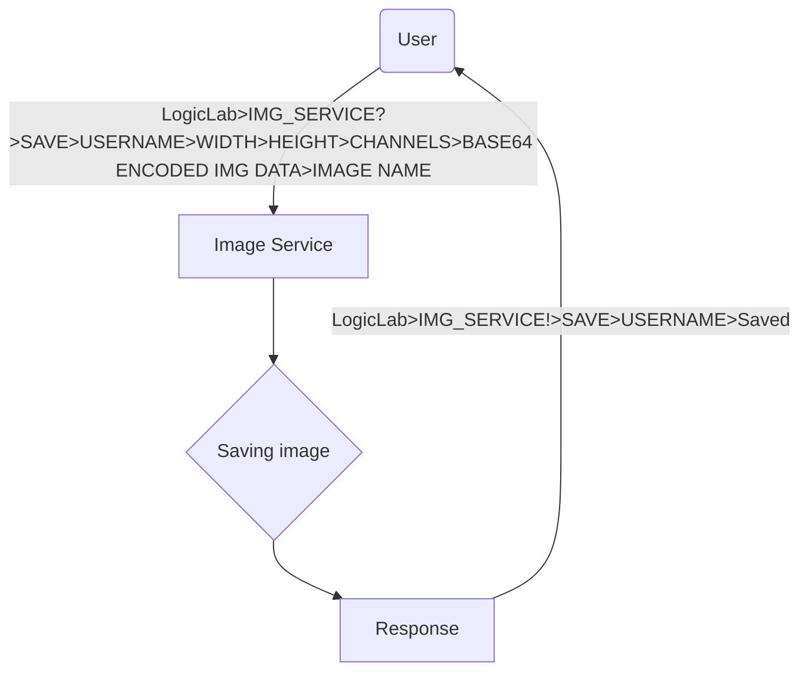
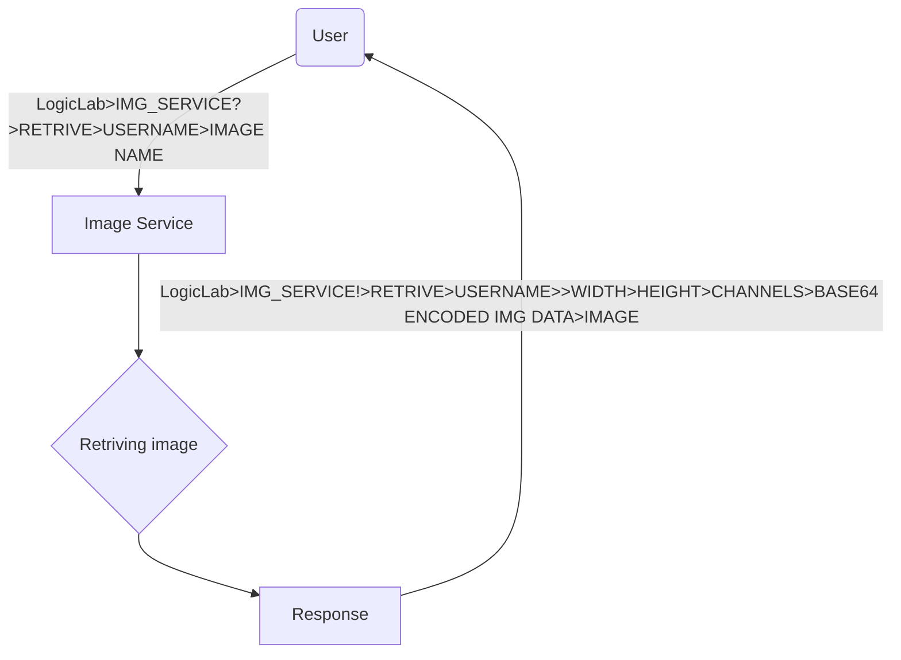
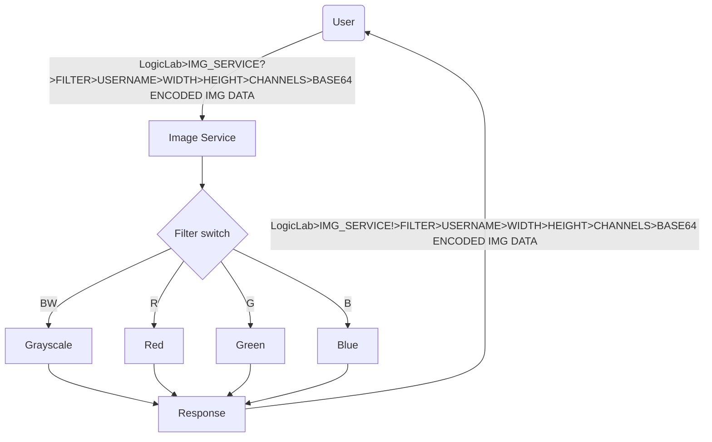

# Logic Lab Image Service
Welcome to`Logic Lab Image Service!` This service, running on `Bennternet` using `ZeroMQ (ZMQ)`, offers multiple "robust" features including:

- Image Storage: "Efficient" and "secure storage" solutions for your images, ensuring "quick" retrieval and safe keeping.
- Image Filtering: A variety of "advanced" filtering options to enhance and transform your images to meet your "specific needs".
- Heartbeat Channel: A continuous monitoring service.

Whether you’re looking to store, modify, or monitor my service, Logic Lab Image Service is designed to meet your needs with "reliability" and "ease".

# how to use it 
## Storage
### SAVE
use `ZMQ` to 

- Subscribe to `LogicLab>IMG_SERVICE!>{$FILTER}>{$USERNAME}`
  with an expected return of `LogicLab>IMG_SERVICE!>{$FILTER}>{$USERNAME}>Saved`

- send to `LogicLab>IMG_SERVICE?>{$FILTER}>{$USERNAME}>{$FILTER}>{$WIDTH}>{$HEIGHT}>{$CHANNELS}>{$BASE64 ENCODED IMG DATA}>{$IMAGE NAME}`

### Retriving 
use `ZMQ` to 

- Subscribe to `LogicLab>IMG_SERVICE!>{$FILTER}>{$USERNAME}`
  with an expected return of `LogicLab>IMG_SERVICE?>{$FILTER}>{$USERNAME}>{$FILTER}>{$WIDTH}>{$HEIGHT}>{$CHANNELS}>{$BASE64 ENCODED IMG DATA}>`

- send to `LogicLab>IMG_SERVICE!>{$FILTER}>{$USERNAME}>{$IMAGE NAME}`

## Filters
use `ZMQ` to 
- Subscribe to `LogicLab>IMG_SERVICE!>{$FILTER}>{$USERNAME}`
  with an expected return of `LogicLab>IMG_SERVICE!>{$FILTER}>{$USERNAME}>{$WIDTH}>{$HEIGHT}>{$CHANNELS}>{$BASE64 ENCODED IMG DATA}`
  
- send to `LogicLab>IMG_SERVICE?>{$FILTER}>{$USERNAME}>{$WIDTH}>{$HEIGHT}>{$CHANNELS}>{$BASE64 ENCODED IMG DATA}`

### Concept Diagram

## Heartbeat
use `ZMQ` to 
- Subscribe to `LogicLab>IMG_SERVICE!>BIEP`
# Feeling lost ?
There is a Image Service client that makes it effortless to interact with our service.