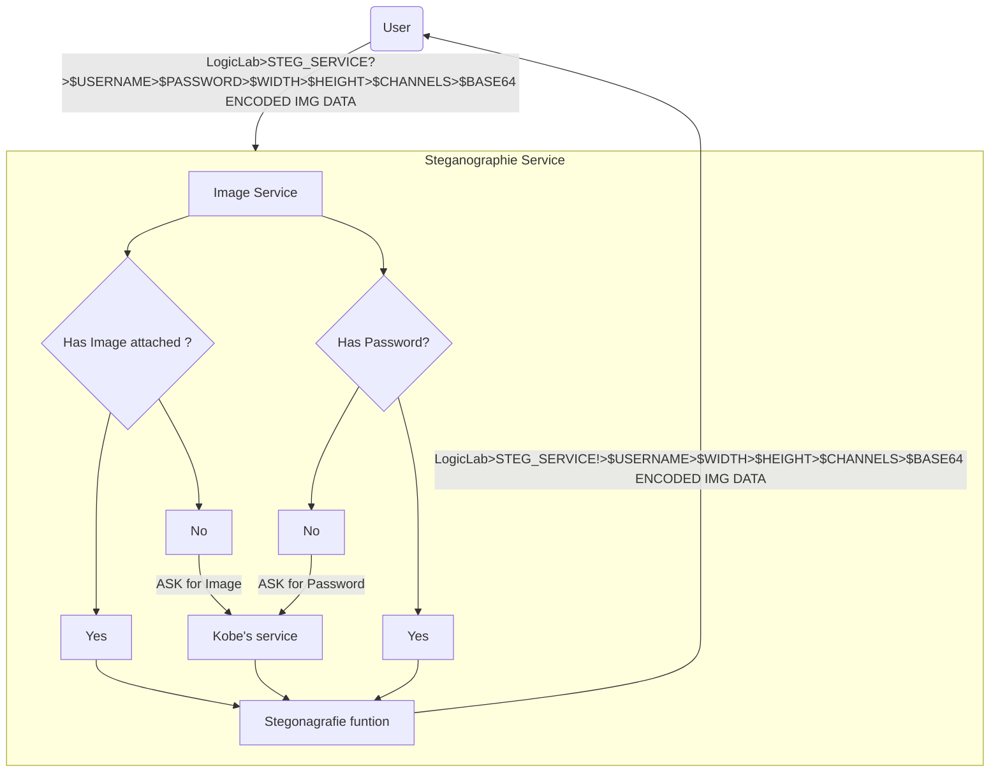
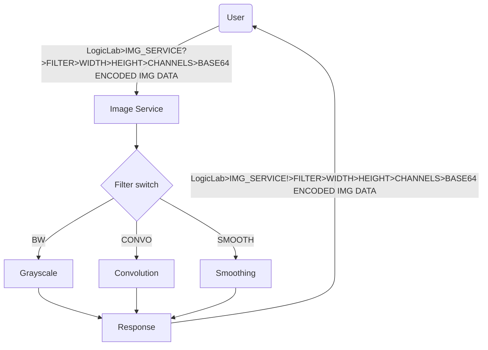

## Steganografie  service
### how to use it 
use `ZMQ` to 

- Subscribe to `LogicLab>STEG_SERVICE!>{$USERNAME}>`
  with an expected return of `LogicLab>STEG_SERVICE!>{$USERNAME}>{$WIDTH}>{$HEIGHT}>{$CHANNELS}>{$BASE64 ENCODED IMG DATA}`

- send to `LogicLab>STEG_SERVICE?>{$USERNAME}>{$PASSWORD}>{$WIDTH}>{$HEIGHT}>{$CHANNELS}>{$BASE64 ENCODED IMG DATA}`
### flowchart 

## Filter service
### how to use it 
use `ZMQ` to 

- Subscribe to `LogicLab>STEG_SERVICE!>{$USERNAME}>`
  with an expected return of `LogicLab>STEG_SERVICE!>{$USERNAME}>{$WIDTH}>{$HEIGHT}>{$CHANNELS}>{$BASE64 ENCODED IMG DATA}`

- send to `LogicLab>STEG_SERVICE?>$USERNAME>$PASSWORD>$WIDTH>$HEIGHT>$CHANNELS>$BASE64 ENCODED IMG DATA`

## punten verdeling

|           | 1                                                            | 2                                                            | 3                                                            | 4                                                            | 5                                                            |
| --------- | ------------------------------------------------------------ | ------------------------------------------------------------ | ------------------------------------------------------------ | ------------------------------------------------------------ | ------------------------------------------------------------ |
| C++_&_OOP | Er is werkende code, maar het is geen C++ code of niet object georiënteerd geschreven. | Er is werkende code en grotendeels object georiënteerd geschreven, maar veel te grote methodes en/of zeer moeilijk om te onderhouden en/of er is nog (te veel) duplicate code. | De werkende code is in objecten en methodes, goed onderhoudbare code en naamgeving, geen duplicate codes, geen extreme functies definities. | De werkende code is uniform en mooi object georiënteerd geschreven. De leesbaarheid is perfect om zelf verder in te kunnen werken en/of er zijn moderne technieken juist gebruikt (e.g. Signals&Slots). | Deze code is klaar om met de wereld te delen en/of er zijn veel moderne technieken gebruikt die de code niet alleen goed leesbaar houden, maar ook zeer robust. |
| Benternet | Er is een werkende en nuttige service m.b.v. ZMQ, maar ze werkt niet over de voorziene Benternet. | Er is een werkende en nuttige service en werkt juist over de voorziene Benternet, maar ze werkt niet helemaal zoals het hoort (e.g. geen juiste filtering, overdreven nutteloos verkeer). | `Er is een werkende en nuttige service en werkt juist over de voorziene Benternet.` | Het is een absoluut nuttige service die geïntegreerd deel uit maakt van Benternet (i.e. door anderen opgeroepen kan worden en nuttig zijn en/of andere services worden opgeroepen vanuit deze service) en/of andere ZMQ sockets worden aangemaakt voor peer-to-peer verbindingen die werk offloaden. Alle mogelijke berichten zijn logisch voorzien en volgen eenzelfde standaard. | Er wordt duidelijk intelligent gebruik gemaakt van andere Benternet services en/of ZMQ sockets. Volledig volgens de standaarden en performant. |
| Autonomie | Er wordt geen input van de gebruiker verwacht, maar de service kan maar 1 request afhandelen en moet dan herstart worden. | De service werkt volcontinue autonoom (i.e. zonder input van gebruiker en geen reboots nodig), maar het kan wel in een deadlock geraken als de client tussendoor afgesloten wordt. | Service werkt volcontinue autonoom/stand-alone (i.e. eens gestart geen interactie van de gebruiker op die toepassing nodig heeft, niet moet herstarten voor elke nieuwe request). | De service kan zelfs meerdere clients simultaan bedienen ongeacht de status van de service d.m.v. slimme opvolging. | De service houdt verschillende statussen bij om meerdere sessies simultaan te kunnen bedienen (e.g. aparte channels). |
| Diensten  | Er wordt naar berichten geluisterd waarop subscribed is, maar slechts volledige string matching wordt toegepast en niets geparsed. | `Meer dan 1 soort dienst wordt aangeboden en minstens 1 bevat parameters die eruit geparsed moeten worden, maar heel gevoelig aan fouten en/of geen uniforme logica.` | Er zijn meerdere diensten die parallel aangeboden worden (minstens 3 topics tegelijk afhandelen, al dan niet nuttig) en duidelijk logisch en mooi afgehandeld worden. Er is ook minstens 1 dienst waaruit parameters geparsed worden en er is een basis aan veiligheid ingebouwd. | Alle diensten om het geheel werkend te krijgen voor MVP, worden aangeboden en zuiver afgehandeld. Er is ook minstens 1 dienst waaruit parameters geparsed worden en variatie op die parameters worden ook toegelaten en fouten worden veilig en zuiver afgehandeld (i.e. variabelen en memory opruimen). | Er zijn variaties op de MVP toegevoegd om een mooi afgewerkt geheel aan te kunnen bieden. Er zijn meerdere diensten met paramaters en varianten van parameters en elke mogelijke fout wordt opgevangen en afgehandeld en een melding wordt teruggestuurd. |
| Reacties  | Er worden berichten gestuurd, maar het zijn fixed strings zonder veel variaties en/of zonder veel logica. | Er worden meerdere berichten gestuurd en minstens 1 is samengesteld door waarden, maar heel gevoelig aan fouten en/of helemaal niet logisch (e.g. gelijklopend met de subscribe topic, of moeilijk om op te subscriben). | `Er worden meerdere berichten gestuurd en minstens 1 is samengesteld door waarden. De subscribe logica is eenvoudig om alle nodige reacties gericht te kunnen ontvangen en toch ook te kunnen filteren op elk type.` | Alle mogelijke reacties voor een MVP werkend te krijgen worden gestuurd en zijn logisch ingedeeld. Er is minstens 1 reactie met meerdere verschillende waarden of meerdere reacties met een enkele waarden. Elke mogelijke foutmelding heeft een reactie voor feedback. | Er zijn variaties op de MVP toegevoegd om een mooi afgewerkt geheel aan te kunnen bieden. Er zijn meerdere reacties met meerdere waarden. Er is een log kanaal en heartbeat toegevoegd om de service te kunnen monitoren. |
| GitHub    | Er is code op GitHub gezet en er zijn minstens 2 commits, maar allemaal in de laatste week en/of nutteloze commits en/of geen zuiver geheel (e.g. onnodige bestanden staan erop) en/of er is geen goede documentatie. | Er zijn voldoende nuttige, zuivere (i.e. geen onnodige bestanden) en frequente commits (i.e. verspreid over enkele weken) op GitHub, documentatie is nog in startfase, maar het is nog niet professioneel in orde. Er zijn nog werkpunten aan het goed gebruik van git (e.g. geen branches of kleine fouten) en/of documentatie. | Er zijn voldoende nuttige, zuivere en frequente commits op GitHub en mooie duidelijke documentatie met how-to-build en met een overzichtsschema van het netwerk en alle voorziene diensten en reacties. Alle finale code staat ook klaar in een 'live' branch. | Alle mogelijke interacties en communicaties zijn duidelijk en overzichtelijk in een schema gegoten en gedocumenteerd in GitHub. Anderen zouden dankzij deze documentatie gebruik kunnen maken van jouw service zoals een goede API gedocumenteerd hoort te zijn. | Niet alleen documentatie, eindresultaat als geschiedenis zijn professioneel in orde, er is ook gebruik gemaakt van GitHub actions voor een CI/CD flow op te zetten en/of zelftesten uit te voeren. |
| Client    | Er is een rudimentaire client voorzien om niet elk commando apart te moeten typen. Het is echter een domme zender en gerichte ontvanger en/of het is een samenraapsel van executables die bepaalde delen uittesten. | Er is een effectieve client die de nodige diensten kan aanroepen en de reacties weergeeft, echter is ze duidelijk onstabiel en niet aangenaam in gebruik. | Er is een MVP product werkende en de stabiele client kan dit volledig gebruiken. Het is een leverbaar geheel met alle nodige uitleg om dit goede te kunnen gebruiken. | Er is een MVP product werkende en de stabiele client kan dit volledig gebruiken. Het is een leverbaar geheel met alle nodige uitleg om dit goede te kunnen gebruiken. | Er is een stabiele client met een duidelijke en ordelijke GUI. |
|           | Er is 1 extra uitgevoerd (e.g. andere programmeertaal voor client of 2de service, andere netwerkcommunicaties, onderzoeken en aan de praat krijgen van andere apparatuur dat daardoor werkt of te bedienen is over Benternet, onderzoeken en aan de praat krijgen van andere libraries), maar niet heel goed en/of niet echt werkend, maar duidelijk wel aan gewerkt. | Er is 1 extra goed uitgevoerd, of meerdere niet kwalitatieve extra's. | Er is 1 extra perfect uitgevoerd en compleet werkend en geïntegreerd deel in het project, of meerdere kwalitatieve extra's. | Er zijn 2 perfect uitgevoerde extra's.                       | Er zijn 3+ perfect uitgevoerde extra's.                      |

## Todo

- [ ] Make a basic image object and every filter is a child 

- [ ] Make service inputs more flexible aka no fixed positions for data ```LogicLab>(Service name )?>(Data in random order)```

- [ ] Multithread de request handeler

- [ ] Design a steganography system to write and retrive pwd

- [ ] Beg Kobe to make his services


  
